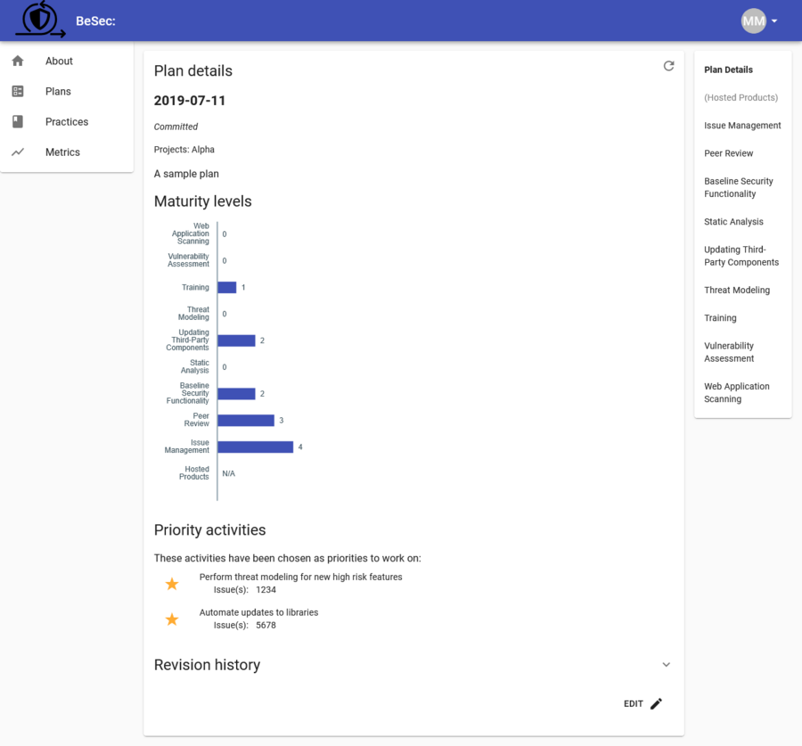

# BeSec

BeSec is a web application that helps organizations adopt a Secure Development
Lifecycle. It is used by engineering teams to learn about the security
activities they are expected to perform, record their current level of adoption,
and plan next steps. It also enables security teams to track maturity over time
across the organization.

Goals:

-   Support engineering organizations with diverse product types, ways of
    working, and levels of maturity.

-   Help engineering teams prioritize adoption of security activities.

-   Enable small security teams to track maturity across a large organization.

Take note of these goals! This may not be the right approach for you if:

-   Your engineering team doesn't fit this diverse profile, such as a company
    working on a single product with a common culture, tools, and processes.

-   You require uniform compliance with all security activities, so your SDLC is
    not compatible with the concept of a maturity model.

-   You don't need a self-service system, in which case a spreadsheet populated by
    security engineers will do the job!

In this document:

-   [Concepts](#concepts)
-   [Use](#use)
-   [Deploy](#deploy)
-   [Manage](#manage)



## Concepts

The security activities in BeSec are grouped into _Practices_. A security team
would typically define these, but we include a set of sample practices with the
tool. An individual _Practice_ covers a single domain, for example static
analysis.

_Activities_ in a practice are discrete tasks or ways of working that teams are
expected to adopt. Each activity is assigned to a maturity level from 1-4.

_Projects_ define the scope of deployment/measurement -
these might cover a development team or a particular product, whatever is the
right fit in the organization.

Within a Project are _Plans_. These represent a
point-in-time maturity measurement against the practices, and optionally a
selection of prioritized activities to focus on next.

A completed plan has a _maturity level_ of 0-4 calculated for each practice,
based on the status of the activities in that practice. A given maturity level
is reached if all of the activities at that level and below are either met or
are not applicable.

## Use

After deploying the application with your organization's security practices, the expected flow is:

1. Perform a guided session with a team, to help identify any misunderstandings
   of the activities and ensure a consistent measurement of maturity levels across
   different teams.

2. On a regular cadence, teams create a new plan (building on their latest
   plan) that reflects any changes in their adoption of the practices. This is a
   self-service activity.

3. Security teams monitor metrics and publish updates to the security
   practices.

## Deploy

BeSec is distributed as a
[binary](https://github.com/ThalesGroup/besec/releases) and a
[containerized](https://gcr.io/besec-project/besec) version of the binary. The
tool functions as both application server and admin client CLI.

BeSec depends on GCP's Cloud Firestore and Firebase Auth; if you would like to
support alternative databases or authentication systems, PRs are welcome.

It can be deployed using Cloud Run - the only prerequisites are a Firestore
database (in Native mode) existing in the project and the Service Account
associated with the instance having access to that database.

See the [CONTRIBUTING.md](./docs/CONTRIBUTING.md) file for instructions on running
the server locally.

### Configure

Config options can be set using any of:

-   commandline flags (run `besec help` for a comprehensive listing of all options)
-   the [`config.yaml`](./config.yaml) file. Keys have the same name as the commandline flags.
-   environment variables, names are the same as the commandline flags, in upper case,
    prefixed with `BESEC_`, and with dashes replaced with underscores. e.g. `BESEC_GCP_PROJECT`

## Manage

There is no admin area of the website, instead admins use the `besec`
commandline tool to directly interact with the backend. Run `besec` to get help
on the available commands.
Administrators need permission to impersonate a service account - set the
terraform `cli-admins` variable appropriately. Note that this service account
should _not_ have any API keys generated for it.

Administrators can manage the site by running:

-   `besec users` - to view, authorize, and remove users.
-   `besec practices` - to publish practice definitions.
    You'll need to do this the first time you run the app and then whenever you change the definitions.

### Manage Users

Users can log in using any of the identity providers configured in the config
file under `auth`. Currently the Google and SAML identity providers are
supported. PRs to add support for other [Google Identity
Platform](https://cloud.google.com/identity-platform/docs/concepts-authentication)
providers are welcome.

If the provider config has `whitelisted: true` set, the user will have access
to the system. Otherwise, users can still log in but will not get access until
an admin authorizes them. If alerts have been configured (`alerts` and one of
the `slack-webhook-*` options has been set), admins are notified when a new
user tries to log in but is not authorized. To authorize a user:

```
$ besec users list
UID                           Email                    Display name  Provider          Status
0C3usgiCJWaxikvduaSdzGRUCLt1  joe.bloggs@example.com  'Joe Bloggs'   saml.my-provider
88Jkby6RamVqz4JGHfF19vK0Lzs1  jane.doe@example.com    'Jane Doe'     google.com        [manually authorized]
...

$ besec users authorize 0C3usgiCJWaxikvduaSdzGRUCLt1
Authorized Joe Bloggs
```

The `trusted-domains` configuration entry is a convenience to users of the CLI
to prevent accidentally adding users from untrusted domains.

### Manage Practices

A fresh deployment of BeSec does not include any practices - an administrator
first has to publish them. We include a sample set of practices in this repo
under [./practices](./practices), however you will likely wish to replace them
with your own. See [docs/examplePractice.yaml](./docs/examplePractice.yaml) for an
annotated sample of the format.

Practices are published together as a set. When a set of practices are
published, a new _practices version_ is created.

When you have updated your practice definition files, publish them to the site
with `besec practices publish`. This is a natural fit for a CI pipeline. The
`besec practices check` command can be used to validate practice syntax prior
to publishing.

Once you have published a set of practices, new plans will use the latest
version, but you can still view old plans and metrics that used an older
definition of the practices.
